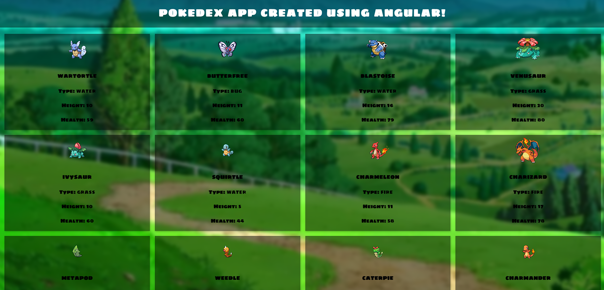

# PokedexAngularApp

## A single page web application of the generation 1 Pokedex built using Angular.js!

---

## Getting Started:

Click here to view [Click Here](https://pokedex-angularjs.netlify.app/)

---

## Technologies Used:
* TypeScript
* HTML
* CSS 
* Node.js 
* Angular
* Google Fonts 

--- 

## Project Screenshots: 


---

## Code Discussion: 
### Fetching the Pokemon API in data.service.ts:
```JavaScript
export class DataService {

  constructor(
    private http: HttpClient
  ) { }

  //get pokemons
  getPokemons(limit: number, offset: number){
    return this.http.get(`https://pokeapi.co/api/v2/pokemon/?limit=${limit}&offset=${offset}`)
  }

  // https://pokeapi.co/api/v2/pokemon/ditto

  //get more pokemons data 
  getMoreData(name: string){
    return this.http.get(`https://pokeapi.co/api/v2/pokemon/${name}`)
  }
}
``` 

### Page Functionality in pokemon-list.component.ts:
```JavaScript
export class PokemonListComponent implements OnInit {
  pokemons: any[] = []
  page = 1 
  totalPokemons: number

  constructor( 
    private dataService: DataService
  ) { }

  ngOnInit(): void {
    this.getPokemons()
  }

  //get pokemons
  getPokemons(){
    this.dataService.getPokemons(12, this.page+0)
    .subscribe((response: any) => {
      this.totalPokemons = response.count 
      
      response.results.forEach(result => {
        this.dataService.getMoreData(result.name)
        .subscribe((uniqResponse: any) => {
          this.pokemons.push(uniqResponse)
          console.log(this.pokemons)
        })
      })
    })
  }

}
```

### Displaying Pokemon Info on pokemon-list.component.html:
```HTML
<!-- Pokemon grid -->
<div class="pokemon-grid">
    <div 
    class="box" 
    *ngFor="let pokemon of pokemons | paginate: { itemsPerPage: 10, currentPage: page, totalItems: totalPokemons }">
        
        <h3>{{ pokemon.name }}</h3>
        <p>
            <b>Type: </b> {{ pokemon.types[0].type.name }}
        </p>
        <p>
            <b>Height: </b> {{ pokemon.height }} 
        </p>
        <p>
            <b>Health: </b> {{ pokemon.stats[0].base_stat }}
        </p>
    </div>
</div>

<pagination-controls (pageChange)="page = $event; pokemons = []; getPokemons()"></pagination-controls>
```

---

## Ket Learnings / Takeaways / Challenges: 
* This is my first project and first time using Angular.js and the TypeScript programming languages. I've done this before in React.js, so it was a fun challenge! 
* Styling & CSS!  